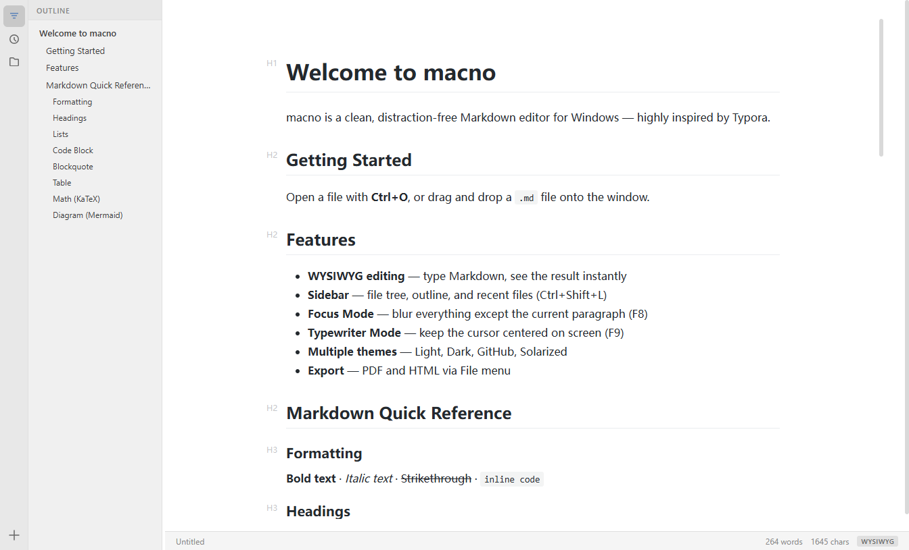

<div align="center">


# macno

**A clean, distraction‑free Markdown editor for Windows — inspired by Typora.**

[](#download)
[](https://www.electronjs.org/)
[](LICENSE)

</div>

---

## What's in a name?

**macno** = **ma**rkdown + **no**te, read as one word — a place to *write notes in Markdown*.

It's also a small joke: **mac‑no** → *no Mac required*. The most-loved seamless Markdown
editors tend to live on macOS; macno brings that same calm, what‑you‑see‑is‑what‑you‑get
writing experience to **Windows**.

## Screenshot

<div align="center">

</div>

## Features

- **Seamless WYSIWYG editing** — type Markdown and see it render instantly, in place (powered by [vditor](https://github.com/Vanessa219/vditor)'s IR mode). No split preview pane, no clutter.
- **Sidebar** — document outline, recent files, and a folder file‑tree. Click an outline heading to jump to it.
- **Focus Mode** (`F8`) — dim everything except the paragraph you're writing.
- **Typewriter Mode** (`F9`) — keep the current line centered on screen.
- **Themes** — Light, Dark, GitHub, and Solarized.
- **Rich content** — tables, task lists, code blocks with syntax highlighting, [KaTeX](https://katex.org/) math, and [Mermaid](https://mermaid.js.org/) diagrams.
- **Find & replace**, word/character count, and live document stats.
- **Export** to PDF and HTML from the File menu.
- **Local‑first** — your `.md` files stay plain Markdown on disk. Open with `Ctrl+O` or drag a file onto the window.

## Download

Grab the latest build from the [**Releases**](../../releases) page:

| File | Description |
|------|-------------|
| `macno-Setup-x.y.z.exe` | Installer. Defaults to `C:\Program Files\macno` (you can choose another folder), creates Start‑menu + desktop shortcuts. |
| `macno-x.y.z-portable.exe` | Portable build — no installation, just run it. |

> The installer is **unsigned**, so Windows SmartScreen or Chinese security suites
> (360 / 电脑管家) may warn on first run — choose *Run anyway* / *Trust*.

## Build from source

Requires [Node.js](https://nodejs.org/) 18+.

```powershell
npm install
npm start          # run in development
npm run build:win  # produce the Windows installer + portable build in release/
```

App icons are generated from `assets/icon.svg` with `npm run make-icons`.
See [BUILD.md](BUILD.md) for full packaging details, including the macOS path.

## Tech stack

- [Electron](https://www.electronjs.org/) — desktop shell
- [vditor](https://github.com/Vanessa219/vditor) — the Markdown editing engine (instant‑rendering mode)
- Vanilla JS / CSS — no front‑end framework

## Roadmap

- [x] Windows installer + portable build
- [ ] macOS build (config ready — see [BUILD.md](BUILD.md); needs a Mac or CI)
- [ ] Linux (AppImage / deb)
- [ ] Image paste & local image management
- [ ] Custom theme support

## License

[MIT](LICENSE) © macno

---

<div align="center">
<sub>made for people who just want to write — on Windows.</sub>
</div>
